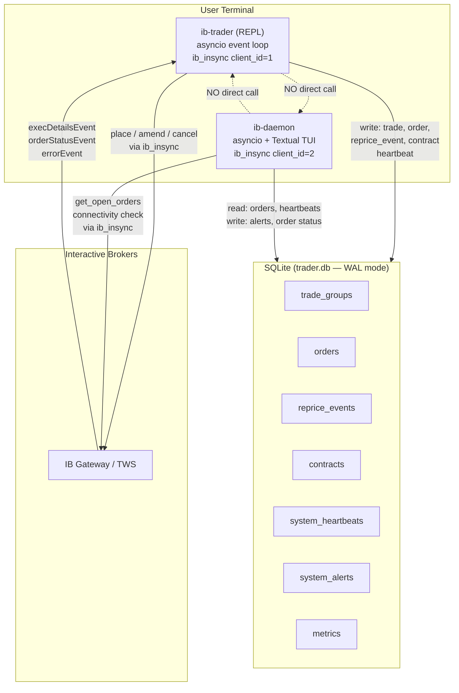
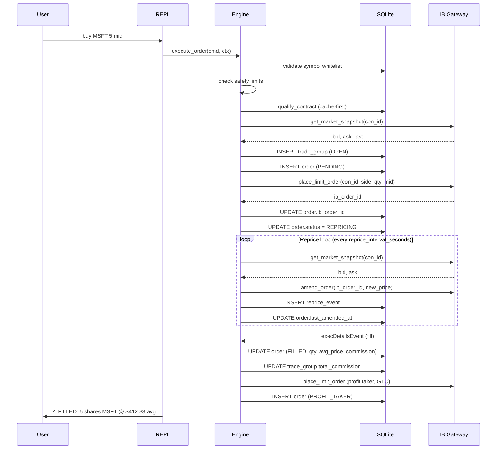
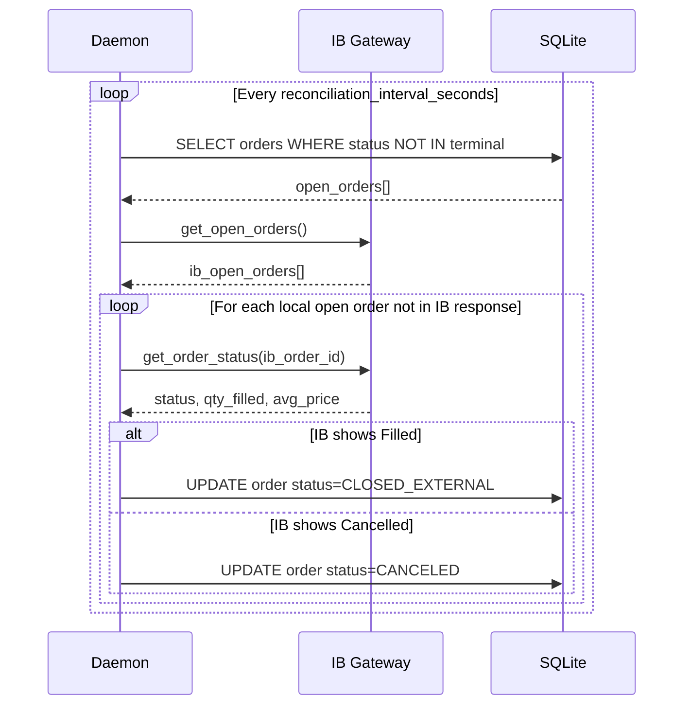
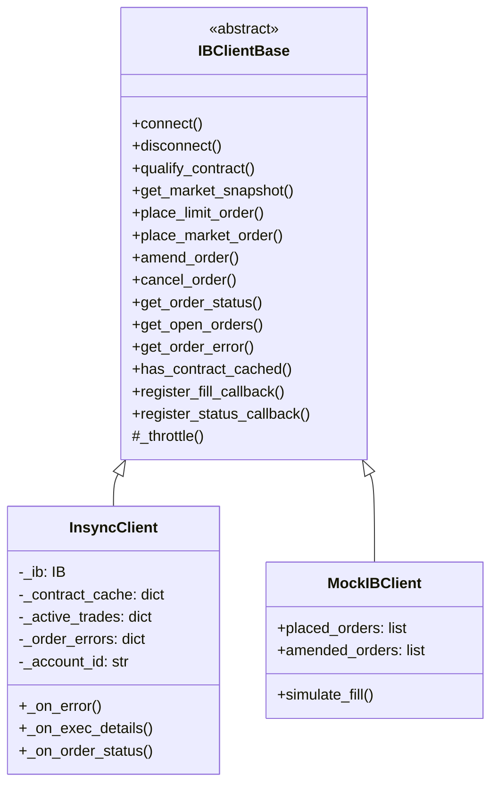

# IB Trader — Technical Design

Version: 0.1.0

---

## System Architecture



The two processes never communicate directly. SQLite is the only IPC mechanism.

---

## Two-Process Model

### REPL (`ib-trader`)

- Owns the user-facing prompt and all order placement.
- Maintains a persistent `ib_insync` connection (client ID from settings, default 1).
- Runs a single asyncio event loop. All IB callbacks are async.
- Writes a heartbeat to `system_heartbeats` every 30 seconds.
- Reads the daemon heartbeat on startup and warns if absent.
- Exits cleanly, deletes its heartbeat row.

### Daemon (`ib-daemon`)

- Runs independently — never started or stopped by the REPL.
- Maintains its own `ib_insync` connection (client ID = REPL client ID + 1).
- Runs three background loops on configurable intervals:
  - **Reconciliation**: compares IB open orders against SQLite, updates discrepancies.
  - **REPL heartbeat monitor**: raises CATASTROPHIC alert if REPL heartbeat is stale.
  - **IB connectivity monitor**: raises CATASTROPHIC alert after 3 consecutive failures.
- Runs SQLite integrity check on startup and every 6 hours.
- Drives the Textual TUI dashboard (read-only from SQLite — never calls IB directly from TUI).
- On CATASTROPHIC alert: pauses all loops, turns TUI red, waits for Enter.

### Why Two Processes

A single process tightly couples the interactive shell with the background watchdog. If
the REPL hangs during a slow order, the watchdog stops. With two processes: the daemon
continues monitoring and reconciling even when the REPL is blocked waiting for a fill.

---

## Zero Memory State

The application can crash at any point and restart with full context from SQLite alone.

- Every IB action is written to SQLite **before** proceeding to the next step.
- Order state is never inferred from in-memory variables — always read from the DB.
- The `OrderTracker` (asyncio events for fill coordination) is ephemeral coordination
  state, not trade state. It is rebuilt per-order from scratch and does not need to
  survive crashes.
- On REPL startup: any order in `REPRICING` or `AMENDING` state is marked `ABANDONED`
  and printed as a warning. The system does not attempt to reconstruct the reprice loop.
- The only acceptable data loss on crash is the current reprice step number and the
  precise amendment price — the order itself is preserved in IB and SQLite.

---

## Data Flow: Order Placement



---

## Data Flow: Daemon Reconciliation



---

## IB Abstraction Layer



All engine code depends only on `IBClientBase`. `InsyncClient` is the only file that
imports `ib_insync`. Tests use `MockIBClient` — no live IB connection required.

The base class provides a built-in throttle layer (`_throttle()`) enforcing a minimum
interval between API calls (default 100 ms). All subclass methods call `_throttle()`
before making any IB request.

---

## SQLite Schema

```
trade_groups          — one row per trade (entry to close)
  id (UUID PK)
  serial_number       — 0-999, reused after close, shown to user
  symbol, direction   — LONG / SHORT
  status              — OPEN / CLOSED / PARTIAL
  realized_pnl, total_commission
  opened_at, closed_at

orders                — one row per order leg
  id (UUID PK)
  trade_id (FK)
  ib_order_id         — assigned by IB, written immediately after place
  leg_type            — ENTRY / PROFIT_TAKER / STOP_LOSS / CLOSE
  side                — BUY / SELL
  security_type       — STK / ETF / OPT / FUT
  order_type          — MID / MARKET / BID / ASK
  qty_requested, qty_filled
  price_placed, avg_fill_price
  profit_taker_amount, profit_taker_price
  stop_loss_requested — stored, no IB action
  commission
  status              — full lifecycle enum
  placed_at, filled_at, canceled_at, last_amended_at
  raw_ib_response     — JSON from IB, stored for audit

reprice_events        — one row per amendment actually sent
  order_id (FK)
  step_number, bid, ask, new_price
  amendment_confirmed
  timestamp

contracts             — contract cache (TTL: 24 h default)
  symbol (PK)
  con_id, exchange, currency, multiplier
  fetched_at

system_heartbeats     — mutual liveness tracking
  process (PK)        — "REPL" or "DAEMON"
  last_seen_at, pid

system_alerts         — CATASTROPHIC / WARNING conditions
  id (UUID PK)
  severity, trigger, message
  created_at, resolved_at

metrics               — time-series events (schema only, not yet written)
  trade_id (FK), event_type, symbol, value, meta, recorded_at
```

WAL mode is enabled on every connection. Foreign key enforcement is on. Schema managed
by Alembic migrations (`migrations/`).

---

## Dependency Injection

`AppContext` is a frozen dataclass created once at process startup and passed to every
engine function and command handler. Nothing constructs its own repositories or IB
client. No global singletons.

```python
@dataclass
class AppContext:
    ib: IBClientBase
    trades: TradeRepository
    orders: OrderRepository
    reprice_events: RepriceEventRepository
    contracts: ContractRepository
    heartbeats: HeartbeatRepository
    alerts: AlertRepository
    tracker: OrderTracker
    settings: dict
    account_id: str
```

---

## Pricing Functions

All in `engine/pricing.py`. Pure functions — no IB calls, no DB access, no side effects.
All inputs and outputs are `Decimal`. No `float` anywhere in the codebase.

| Function | Formula |
|----------|---------|
| `calc_mid` | `(bid + ask) / 2`, rounded to 2dp |
| `calc_step_price(side="BUY")` | `mid + (step/total) * (ask - mid)` |
| `calc_step_price(side="SELL")` | `mid + (step/total) * (bid - mid)` |
| `calc_profit_taker_price` | `avg_fill + (profit / qty)` |
| `calc_profit_taker_price_short` | `avg_fill - (profit / qty)` |
| `calc_shares_from_dollars` | `floor(dollars / mid)`, capped at max |

---

## Alert System

Two severity levels:

| Level | Trigger Examples | Behaviour |
|-------|-----------------|-----------|
| `CATASTROPHIC` | REPL heartbeat stale, SQLite integrity fail, 3× IB connectivity fail | TUI goes red, all loops pause, waits for Enter |
| `WARNING` | Single reconciliation fail, single IB fail, ABANDONED order on startup | Amber indicator, loops continue |

Severity levels are spaced to allow future insertion without restructuring the enum.
A WARNING is never auto-escalated to CATASTROPHIC — only defined triggers can be CATASTROPHIC.

---

## Strategy Enum

```python
class Strategy(StrEnum):
    MID    = "mid"     # mid-price limit, reprice loop
    MARKET = "market"  # market order
    BID    = "bid"     # fixed limit at bid, GTC
    ASK    = "ask"     # fixed limit at ask, GTC
```

Single definition in `repl/commands.py`. Used in command dataclasses and order
dispatch. Adding a new strategy requires one line here — validation everywhere
updates automatically.

---

## Key Design Decisions (ADR Summary)

| ADR | Decision |
|-----|----------|
| 001 | Amendment not cancel-replace — single IB order ID per entry leg |
| 002 | Zero memory state — crash at any point, restart from SQLite |
| 003 | SQLite WAL mode — concurrent reads without blocking writes |
| 004 | SQLite as sole IPC — no sockets, pipes, or shared memory between processes |
| 005 | `Decimal` not `float` — all monetary values |
| 006 | Options/futures readiness — no hardcoded STK assumptions |
| 007 | IB abstraction layer — engine never imports ib_insync |
| 008 | IB rate limiting — 100 ms minimum between calls in base class |
| 009 | REPL not one-shot CLI — persistent session, single IB connection |
| 010 | Mutual watchdog via heartbeat — SQLite only, no process management |
| 011 | Two severity levels — CATASTROPHIC halts, WARNING logs |
| 012 | ib_insync over REST API — full event-driven callback support |
